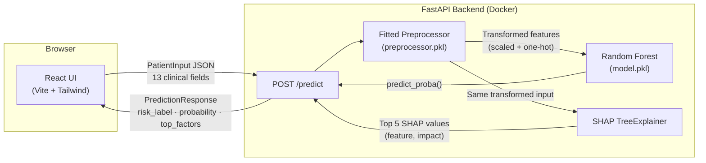

# Heart Health Predictor

[](https://www.python.org/)
[](LICENSE)
[](#)
[](https://fastapi.tiangolo.com/)
[](https://react.dev/)

An AI-powered cardiovascular risk screening tool — enter clinical measurements, get an instant risk estimate with SHAP-driven explanations of which factors drove the prediction.

---

> **🔗 Live demo:** _TODO: add Render/Vercel URL after deploying_

---

## Screenshots

> **TODO:** Take and add screenshots after deploying. Suggested shots:
>
> | Filename | What to capture |
> |---|---|
> | `docs/screenshot-empty.png` | App on first load — form with default values, empty-state placeholder below |
> | `docs/screenshot-high-risk.png` | Submitted high-risk patient — red card, filled progress bar, red SHAP bars |
> | `docs/screenshot-low-risk.png` | Submitted low-risk patient — green card, low probability, all-green SHAP bars |
>
> Once you have the images, replace this block with:
> ```md
> 
> 
> 
> ```

---

<!-- TODO: add a GIF or screenshot of the app here after deployment

-->

## Tech stack

| Layer | Technology |
|---|---|
| ML model | Random Forest (scikit-learn), tuned for recall |
| Explainability | SHAP TreeExplainer |
| Backend | FastAPI + uvicorn, Dockerized |
| Frontend | React 18 + Vite + Tailwind CSS + Recharts |
| Data | UCI Cleveland Heart Disease dataset (303 patients) |

## Local setup

### Prerequisites

- Python 3.10+
- Node.js 18+
- (Optional) Docker + Docker Compose

### Backend

```bash
# From repo root
pip install -r requirements.txt          # ML dependencies
pip install -r backend/requirements.txt  # FastAPI + uvicorn etc.

cd backend
uvicorn app.main:app --reload --port 8001
# API at http://localhost:8001
# Docs at http://localhost:8001/docs
```

### Frontend

```bash
cd frontend
cp .env.example .env    # default points to localhost:8001
npm install
npm run dev
# App at http://localhost:5173
```

### With Docker Compose (both together)

```bash
# From repo root
docker compose up
# Backend: http://localhost:8000
# Frontend: http://localhost:5173
```

## Model results

Three models were tuned with `RandomizedSearchCV` optimising for **recall** (primary metric — in a medical screening context, missing a true disease case is worse than a false positive).

| Model | Accuracy | Precision | Recall | F1 | ROC AUC |
|---|---|---|---|---|---|
| Logistic Regression (tuned) | 0.7705 | 0.7317 | 0.9091 | 0.8108 | 0.8831 |
| **Random Forest (tuned)** ✓ | **0.7869** | **0.75** | **0.9091** | **0.8219** | **0.9232** |
| XGBoost (tuned) | 0.8033 | 0.7692 | 0.9091 | 0.8333 | 0.8690 |

Random Forest was selected: equal recall to XGBoost but best ROC AUC (0.9232) as tiebreaker.

### Global feature importance (SHAP summary)


Each point is one test-set patient. Points to the right (red) push the model toward predicting disease; points to the left (blue) push it away. `thal` and `ca` are the dominant features in this dataset's encoding.

### Single-prediction explanation (SHAP waterfall)


Waterfall plot for one test patient — shows how each feature nudges the prediction up or down from the model's base rate.

## Architecture



A single `/predict` request:
1. `PatientInput` is validated by Pydantic (13 fields, range-checked)
2. Passed through the saved fitted preprocessor (median imputation → standard scaling → one-hot encoding)
3. Random Forest returns class-1 probability
4. SHAP TreeExplainer computes per-feature contributions for that row
5. Top 5 factors by absolute impact are returned alongside the prediction

## Deployment

- **Backend → Render**: see [`backend/README.md`](backend/README.md)
- **Frontend → Vercel**: see [`frontend/README.md`](frontend/README.md)
