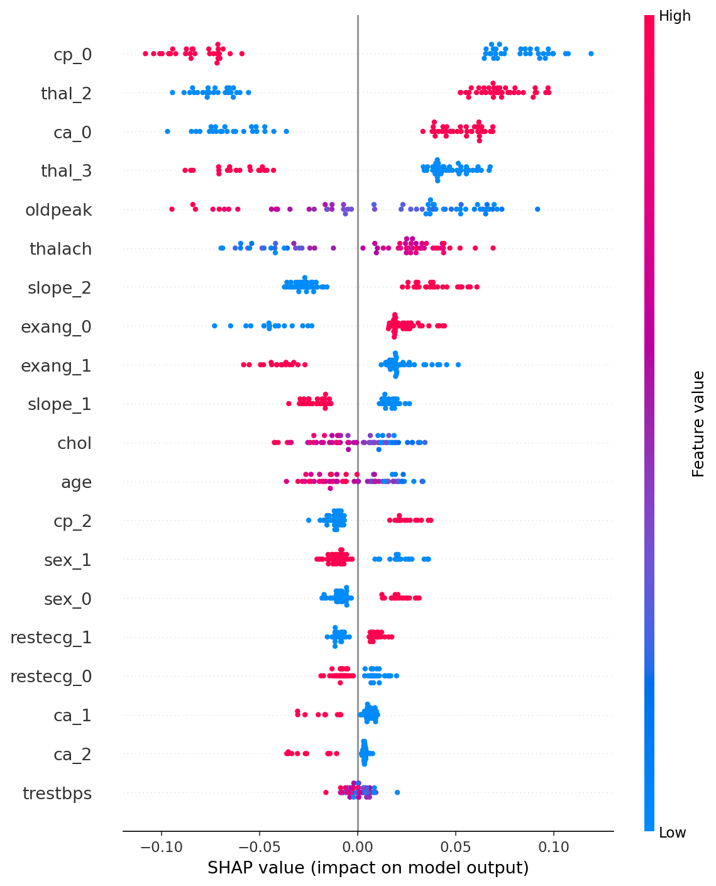
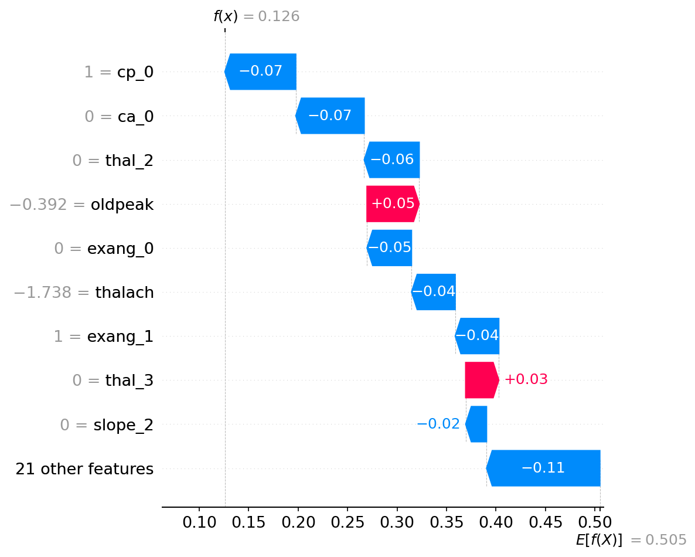
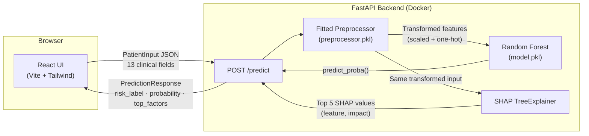

# Heart Health Predictor

[](https://www.python.org/)
[](LICENSE)
[](#)
[](https://fastapi.tiangolo.com/)
[](https://react.dev/)

An AI-powered cardiovascular risk screening tool — enter clinical measurements, get an instant risk estimate with SHAP-driven explanations of which factors drove the prediction.

---

> **🔗 Live demo:** _TODO: add Render/Vercel URLs after deploying_

---

## Screenshots

> **📸 TODO — add after deploying:**
> Take three screenshots of the live app and save them to a `docs/` folder in the repo root:
>
> | Filename | What to capture |
> |---|---|
> | `docs/screenshot-empty.png` | App on first load — intake form, empty state |
> | `docs/screenshot-high-risk.png` | Clinical path result — red card, probability bar, SHAP chart |
> | `docs/screenshot-low-risk.png` | Simple path result — green guidance card |
>
> Then replace this block with:
> ```md
> 
> 
> 
> ```

---

## Design decision: two assessment paths

The UCI Cleveland dataset requires clinical measurements — cholesterol, ECG results, stress test data — that most people don't have readily available. Asking for these fields upfront would make the tool useless for anyone without recent lab results. So the app branches at intake: users with medical reports get the full ML-driven risk score with SHAP explanations; users without get a short rule-based guidance form covering self-reportable factors (chest pain, breathlessness, family history, smoking) that tells them what tests to ask their GP for. The ML model is only invoked on the clinical path — the simple path is transparent if/else logic with no black box.

## Tech stack

| Layer | Technology |
|---|---|
| ML model | Random Forest (scikit-learn), tuned for recall |
| Explainability | SHAP TreeExplainer |
| Backend | FastAPI + uvicorn, Dockerized |
| Frontend | React 18 + Vite + Tailwind CSS + Recharts |
| Data | UCI Cleveland Heart Disease dataset (303 patients) |

---

## Local setup

### Prerequisites

- Python 3.10+
- Node.js 18+
- (Optional) Docker + Docker Compose

### Backend

```bash
# From repo root
pip install -r requirements.txt          # ML engine: sklearn, shap, xgboost, etc.
pip install -r backend/requirements.txt  # API layer: FastAPI, uvicorn, etc.
# Two separate files — root handles model training and inference deps,
# backend/ handles the web framework. Both are needed to run the server.

cd backend
uvicorn app.main:app --reload --port 8001
# API:  http://localhost:8001
# Docs: http://localhost:8001/docs
```

### Frontend

```bash
cd frontend
cp .env.example .env    # defaults to localhost:8001 — change if needed
npm install
npm run dev
# App: http://localhost:5173
```

### Both together with Docker Compose

```bash
# From repo root
docker compose up
# Backend:  http://localhost:8000
# Frontend: http://localhost:5173
```

---

## Model results

Three models were tuned with `RandomizedSearchCV` optimising for **recall** — in a medical screening context, missing a true disease case is worse than a false positive.

| Model | Accuracy | Precision | Recall | F1 | ROC AUC |
|---|---|---|---|---|---|
| Logistic Regression (tuned) | 0.7705 | 0.7317 | 0.9091 | 0.8108 | 0.8831 |
| **Random Forest (tuned)** ✓ | **0.7869** | **0.75** | **0.9091** | **0.8219** | **0.9232** |
| XGBoost (tuned) | 0.8033 | 0.7692 | 0.9091 | 0.8333 | 0.8690 |

Random Forest was selected: equal recall to the others, highest ROC AUC (0.9232) as tiebreaker.

### Global feature importance (SHAP summary)



Each dot is one test-set patient. Dots to the right push the model toward predicting disease; dots to the left push it away. `thal` and `ca` dominate — an artifact of this dataset mirror's encoding (see [`data/README.md`](data/README.md) for details).

### Single-prediction explanation (SHAP waterfall)



Shows how each feature nudges one patient's prediction up or down from the model's base rate.

---

## Architecture



A single `/predict` request:
1. `PatientInput` is validated by Pydantic (13 fields, range-checked)
2. Passed through the saved fitted preprocessor — median imputation → standard scaling → one-hot encoding
3. Random Forest returns class-1 probability
4. SHAP TreeExplainer computes per-feature contributions for that specific row
5. Top 5 factors by absolute impact are returned alongside the prediction

---

## Deployment

| Service | Platform | Guide |
|---|---|---|
| Backend (FastAPI) | Render (Docker) | [`backend/README.md`](backend/README.md) |
| Frontend (React) | Vercel | [`frontend/README.md`](frontend/README.md) |

After deploying, set `VITE_API_URL` in your Vercel environment variables to the Render service URL, then redeploy the frontend.

---

## License

[MIT](LICENSE)
