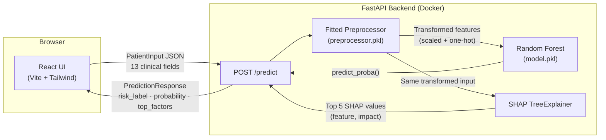

# Heart Health Predictor

An AI-powered cardiovascular risk screening tool — enter clinical measurements, get an instant risk estimate with SHAP-driven explanations of which factors drove the prediction.

---

> **🔗 Live demo:** _TODO: add Render/Vercel URL after deploying_

---

<!-- TODO: add a GIF or screenshot of the app here after deployment

-->

## Tech stack

| Layer | Technology |
|---|---|
| ML model | Random Forest (scikit-learn), tuned for recall |
| Explainability | SHAP TreeExplainer |
| Backend | FastAPI + uvicorn, Dockerized |
| Frontend | React 18 + Vite + Tailwind CSS + Recharts |
| Data | UCI Cleveland Heart Disease dataset (303 patients) |

## Local setup

### Prerequisites

- Python 3.10+
- Node.js 18+
- (Optional) Docker + Docker Compose

### Backend

```bash
# From repo root
pip install -r requirements.txt          # ML dependencies
pip install -r backend/requirements.txt  # FastAPI + uvicorn etc.

cd backend
uvicorn app.main:app --reload --port 8001
# API at http://localhost:8001
# Docs at http://localhost:8001/docs
```

### Frontend

```bash
cd frontend
cp .env.example .env    # default points to localhost:8001
npm install
npm run dev
# App at http://localhost:5173
```

### With Docker Compose (both together)

```bash
# From repo root
docker compose up
# Backend: http://localhost:8000
# Frontend: http://localhost:5173
```

## Architecture



A single `/predict` request:
1. `PatientInput` is validated by Pydantic (13 fields, range-checked)
2. Passed through the saved fitted preprocessor (median imputation → standard scaling → one-hot encoding)
3. Random Forest returns class-1 probability
4. SHAP TreeExplainer computes per-feature contributions for that row
5. Top 5 factors by absolute impact are returned alongside the prediction

## Deployment

- **Backend → Render**: see [`backend/README.md`](backend/README.md)
- **Frontend → Vercel**: see [`frontend/README.md`](frontend/README.md)
